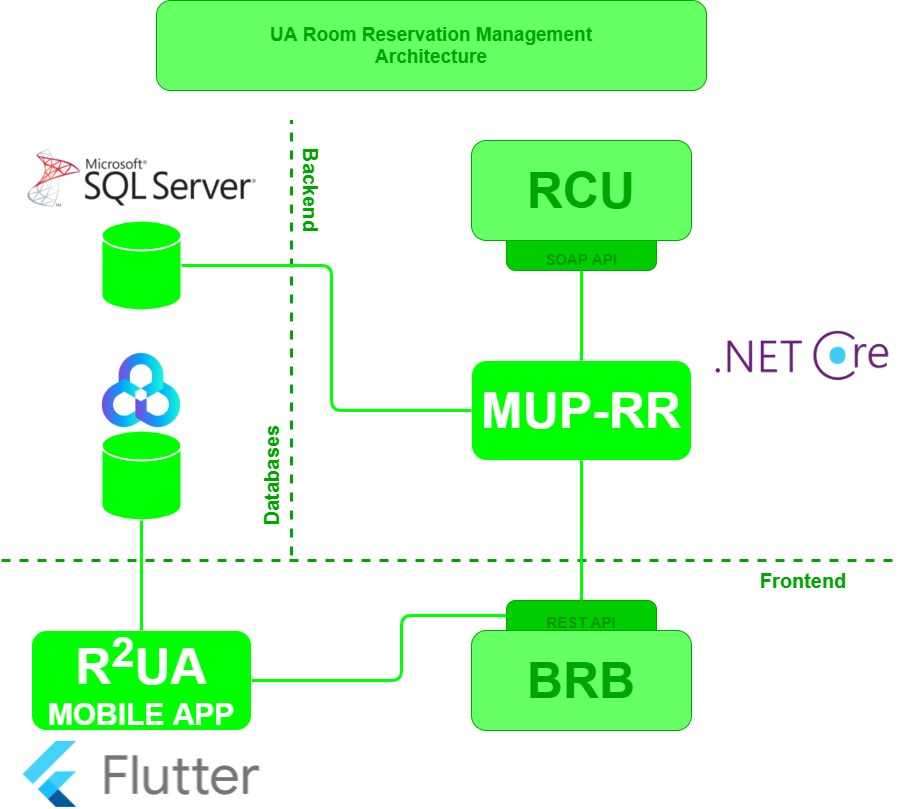

# MUP-RR - Gestão Integrada de Reserva de Salas da UA​

- [1. Inception Phase](#1-inception-phase)
  - [1.1. Context](#11-context)
  - [1.2. Problem](#12-problem)
  - [1.3. Personas](#13-personas)
  - [1.4. Goal](#14-goal)
  - [1.5. Task List](#15-task-list)
  - [1.6. Expected Results](#16-expected-results)
  - [1.7. Related work](#17-related-work)
  - [1.8. Communication Plan](#18-communication-plan)
  - [1.9. Team Roles](#19-team-roles)
  - [1.10. Project calendar](#110-project-calendar)
- [2. Elaboration Phase](#2-elaboration-phase)
  - [2.1. Requirements gathering](#21-requirements-gathering)
  - [2.2. State of The Art (SOA)](#22-state-of-the-art)
  - [2.3. Functional requirements](#23-functional-requirements)
    - [2.3.1. MUP-RR](#231-mup--rr)
    - [2.3.2. Mobile App R2UA](#232-mobile-app-r2ua)
  - [2.4. Non-functional requirements](#24-non-functional-requirements)
    - [2.4.1. MUP-RR](#241-mup--rr)
    - [2.4.2. Mobile App R2UA](#242-mobile-app-r2ua)
  - [2.5. Actors](#25-actors)
  - [2.6. Use Cases](#26-use-cases)
    - [2.6.1. Use Cases diagram](#261-use-cases-diagram)
  - [2.7. System Architecture](#27-system-architecture)
    - [2.7.1. Architecture Diagram](#271-architecture-diagram)
    - [2.7.2. Deployment Diagram](#272-deployment-diagram)
  - [2.8. Domain Model](#28-domain-model)
  - [2.9. Mockup - Low fidelity prototype](#29-mockup---low-fidelity-prototype)

## 1. Inception Phase

### 1.1. Context

A university like our’s has a large number of rooms and of varying sizes and functionalities, rooms that are used for the classes, meetings, or even for study groups to use.

The university of Aveiro has an initial system of room reservation, developed by an external company, Bullet Solutions, it’s called Bullet Room Booking and contains a central database where all events are registered. This system is soon to be expanded to all of the academic community, that includes over 13000 students, 1150 teachers and researchers and 650 administrative and management staff.

### 1.2. Problem

The rooms in UA are inefficiently used, because of the independent management inherent to each department. A group of teachers from Dbio may want to arrange a meeting but asking the department’s secretary informs them that there won’t be an available room until sunday, however there was an available meeting room all week at DETI. 

The BRB platform was designed to solve this problem providing a central reservation system for all the UA. The web portal of this system allows every user to reserve any room of the university following certain rules according to the permissions of the user. 

However BRB has a few problems that are impeding its release to the full academic community:

Firstly, being a more generic system that could work for any university, it can’t comply with every ruling and exception of UA, so certain people might not fit into the defined user types and permissions.

Secondly, as it stands, when a user registers on BRB he is given the “Default” user type, that doesn’t allow him many features. It then is up to an administrator to manually assign a role to each user according to their position at the university, something the admin would need to know as it’s information external to the BRB.

Managing the access and permissions of the whole academic body would be a task far too complex to be done manually by an administrator.

### 1.3. Personas

- **Academic Staff**

  António Marques, 47 years old lives in Aveiro and currently works at the city’s University as a professor. As a professor, he needs to plan and book certain rooms for his exams. As such, whenever he needs a room for an event in the University, he has to contact the department he wants for availability and book it. António Marques feels like this process is not efficient at all and there should be an automatic way of doing this. As such, he feels that the  Name here feels like an online app that manages this situation would be much easier and efficient  

- **Student**

  Gonçalo Baptista, 20 years old. Lives in Lisbon but studies at Universidade de Aveiro. As a student from another city, he’s renting a room in a very noisy house. As such, he needs a place where he can study and solve his problems with his friends. As the library is almost always full and noise should be kept to a minimum, he feels like booking a room at his department would be a great solution. As a student of ET, the room should be equipped with some machines that he needs for his studies. Gonçalo feels like there should be an application that could let students ask for permission to rent a room so that they can use it.

  - **Room Group Responsible**

  Rita Santos, 56 years old lives in Aveiro and works at the city’s University as a staff member of DETI. Furthermore  she’s the one responsible for the delegation of rooms at the department she works, according to requests from professors and students. She feels that the current procedure for room booking is just too tedious as the time spent defining the needed characteristics of a room and checking availability is just a waste as she has other work to do.     As such, she feels like an easy to use application where all this procedure is summarized would be much more efficient and much less time consuming as she would only have to grant or deny the requests.

### 1.4. Goal

Given this problem, our main and initial goal is to develop a module that will assist the permissions management functionalities of BRB. This module will be called Manager of User Permissions for Room Reservation, or for short MUP-RR.

Our plan is for it to be a sort of communication broker between the BRB and the RCU, the existing system at UA that holds all users and their information. This way our module would detect any new user or change in the user’s status through the RCU and taking into account the defined regulations would decide the permission the user should have and communicate them to BRB.

Completing this and therefore having a usable and manageable system for room booking we want to put it into action and develop a mobile app, oriented for the students of the university, on top of our created module. Intended for students to quickly check the rooms available around them and book them, always according to regulations of course. Having this app would make room use more efficient on the student front at university.

### 1.5. Task List

**Module: Mobile App (Inês Leite and Alexandre Rodrigues)**

- **Task 1:** Create use cases.
- **Task 2:** Create prototype.
- **Task 3:** Create Outsystems mobile App.

**Module: Existing Systems Handling (Alexandre Rodrigues and Pedro Marques)**

- **Task 1:** Understand the RCU functionalities.
- **Task 2:** Experiment with BRB.
- **Task 3:** Analyze current types of users and permissions.
- **Task 4:** Determine new users and permission rules.

**Module: Database (Inês Leite and Rui Fernandes)**

- **Task 1:** Create the database prototype.
- **Task 2:** Implement the database schema.

**Module: MUP-RR (Rui Fernandes, Pedro Marques)**

- **Task 1:** Set up data influx from RCU.
- **Task 2:** Implement data processing and permission handling.
- **Task 3:** Establish communications with BRB.

### 1.6. Expected Results

With our project we aim to supply the university with a system that can allow the deployment of BRB to the whole community. Furthermore we wish that our student oriented app that draws on the whole room booking service will come to fruition as an actual useful tool for students in the future, making life at UA slightly more convenient.

### 1.7. Related work

We researched for similar systems and applications, some of which were:

- **Meetio:** [https://www.meetio.com/lp/meeting-room-booking-system](https://www.meetio.com/lp/meeting-room-booking-system)
- **Robin:** [https://robinpowered.com/overview](https://robinpowered.com/overview)
- **Condeco:** [https://www.condecosoftware.com/products/meeting-room-booking/](https://www.condecosoftware.com/products/meeting-room-booking/)

### 1.8. Communication Plan

- **Code Sharing and CI:** For our code sharing we will be using this very Github repository, it is a platform we are very confortable with and some experience following a feature branch workflow using it.

- **Backlog Management:** For backlog management we will use Jira because it is a powerfull tool that provides great project tracking for teams. Additionally we had already used the tool before, and intend on following a Kanban board tactic.

- **Team Communication:** In regards to communication amongst team members we will be using Discord since it’s our more informal day to day platform. As for more formal contact that includes our advisors we will use Microsoft Teams where we can schedule meetings, share files and much more. Additionally we will use Google Drive for quick file sharing and editing, more on the front of presentations and documentation.

### 1.9. Team Roles

- **Project Manager:** [Rui Fernandes](https://github.com/Rui-FMF)
- **DevOps Master:** [Pedro Marques](https://github.com/PedroMarques27)
- **Architect:** [Alexandre Rodrigues](https://github.com/alex-pt01)
- **Product Owner:** [Inês Leite](https://github.com/inespl)
- **Advisor:** [Professor José Vieira](https://www.ua.pt/pt/p/10311461)
- **Co-Advisor:** [Engenheiro Filipe Trancho](https://www.ua.pt/pt/p/10316739)

### 1.10. Project calendar

This is our project calendar:

## 2. Elaboration Phase

### 2.1. Requirements gathering

To truly accomplish our goals with this project, we needed to establish solid requirements for both parts of it, the backend mediator MUP-RR and the mobile app R2UA (Room Reservation UA).
With this in mind we resorted to three methods, in increasing order of importance and impact:

We researched for other similar projects and systems for inspiration, to understand what had been done right and wrong and how we can do it differently. Despite being a generally useful method, we had difficulty finding similar systems that we could actually take ideas from.

Secondly, we *brainstormed* together in many sessions as to ascertain and decide things like wanted and essential features, systems boundaries and user types and interaction.

Finally, and most importantly, the weekly meetings we held with our advisor and co-advisors, in those meetings they brought to the table what was truly essential and gave us many suggestions for features, solidifying our ideas.

An important note is that inquiries and interviews could be useful on the mobile app front, to discern what end-users would want in an application for room reservation at the university, however because of time constraints we left this out of the equation.

### 2.2. State of The Art

In regards to **MUPP-RR** it was quite hard to find anything relevant, and what was found would never be of much use since it wasn't open source and mostly did not fit within the same context as our project.
Regardless the findings were:

- **[Manage Engine - NTFS Permissions](https://www.manageengine.com/products/ad-manager/ntfs-share-permissions-management-tool.html)**
- **[Helge Klein - SetACL Studio](https://helgeklein.com/setacl-studio/)**
- **[Visual Guard Winconsole](https://www.visual-guard.com/EN/net-powerbuilder-application-security-authentication-permission-access-control-rbac/vg-winconsole-create-declare-manage-user-role.html)**

### 2.3. Functional requirements

#### 2.3.1. MUP-RR

The Manager of User Permissions for Room Reservation should be capable of:

- Constantly listening to RCU for changes in user bonds and discern if the user that was altered is registered in BRB and, if thats the case, update their permissions.
- Automatically giving BRB users the corresponding permissions based on the information gathered from RCU.
- Periodically calling on BRB for new users and consequently asking RCU for their bonds so they can be given their permissions.
- In case of an error where MUP-RR goes down, it should be possible to backtrack and get all the changes to the bonds in RCU in that timeframe.

#### 2.3.2. Mobile App R2UA

As for our mobile app, R2UA should primarily be capable of:

- Logging in and out with University’s account through idp ua.
- Search classrooms with filtering capabilities, for example by department, capacity, availability and room type.
- Booking classrooms or canceling reservations
- Checking current and past reservations
- Finding and booking nearby classrooms

### 2.4. Non-functional requirements

Our systems must also meet certain non-functional requirements, as in, not directly related to the functionality of the system but instead with quality aspects important in software systems.

#### 2.4.1. MUP-RR

The Manager of User Permissions should respect the following non-functional requirements::

- **Security**: Since the system will deal with private data, it's important that security is tight. Given this, MUP should follow the principles of Privacy by Design and Security by Design, in accordance with the demands of RGPD - *"Regulamento Geral de Proteção de Dados"*. 
- **Reliability** - In case of failure, when the system is rebooted, it should update all information reggarding alterations during down time.
- **Efficiency**: Given the vast amount of members of the academic community, the platform should be able to process a high traffic of requests and responses quickly.

#### 2.4.2. Mobile App R2UA

The mobile app should respect the following non-functional requirements:

- **Security**: Since the app's use is restricted to a certain group of users, it should only allow access to users with authorization.
- **Usability**: The mobile app should be intuitive so it provides an easy and quick usage experience, aiming to waste little time for the user to understand how to use the app.
- **Compatibility**: The application should work on any Operating system, namely Android OS and iOS.
- **Reusability**: The components that are developed and tested should be able to be reused.
- **Efficiency**: Given the vast amount of potential users of the academic community, the platform should be able to process a high traffic of requests and responses quickly.

### 2.5. Non-functional requirements

Regarding the mobile app, the actors at play are the members of the academic community, which can be divided as follows:

Student - Any student enrolled at University of Aveiro, has the most limited permissions, for almost all rooms they are restricted to making a request for reservation, having to wait for approval from the corresponding department's secretary.

Teacher/Staff - A part of the academic staff of UA, be they a teacher, researcher or staff, tem have wider permissions for immediate reservation of rooms in the room group they are assigned to.

Owner of Room Group - Member of staff responsible for delegation of reservations, besides having access to reserve any room in their group, they can also delete other's reservations.

When it comes to MUP-RR the only active actor is the:

Administrator - Responsible for maintaining MUP-RR operational, they have direct access to it and can stop or restart it if necessary.

#### 2.6. Use Cases

#### 2.6.1. Use Case Diagram

### 2.7. System Architecture

#### 2.7.1. Architecture Diagram

### 2.8. Domain Model

### 2.9. Mockup - Low fidelity prototype

A low fidelity prototype of our mobile app R2UA is available at http://shorturl.at/uxTV6 .
